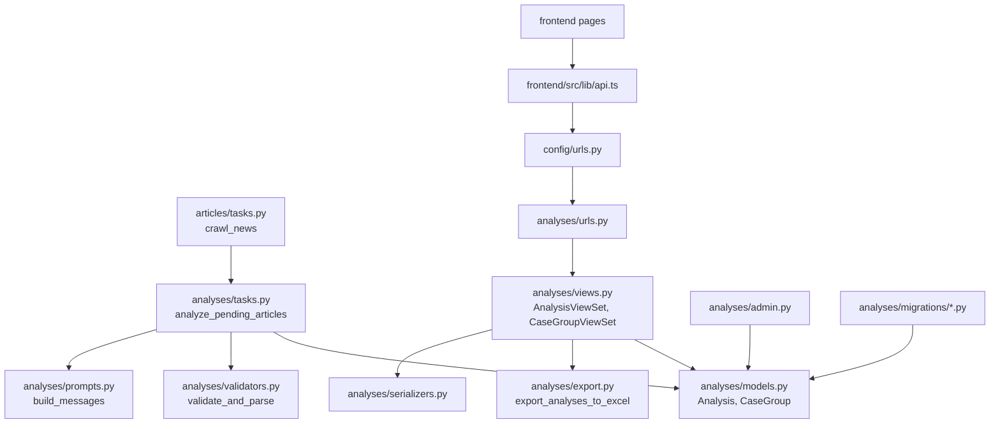
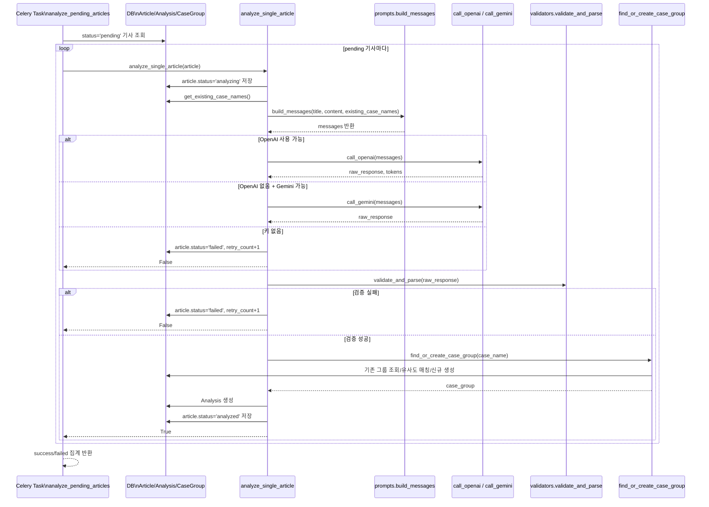
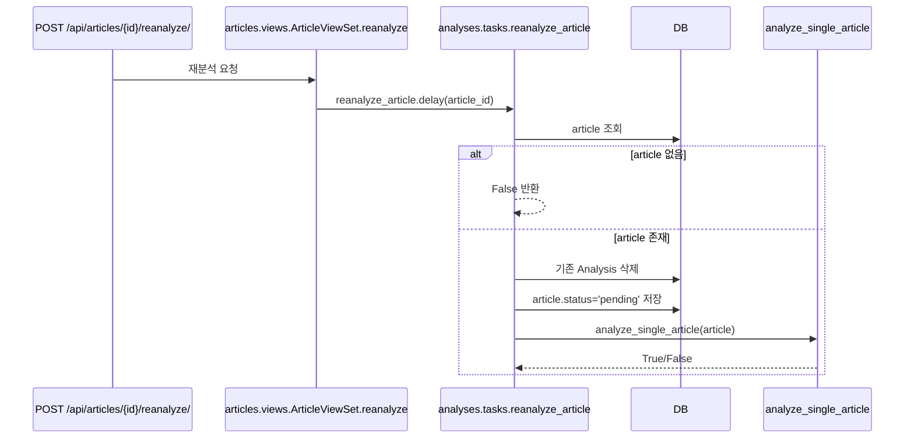
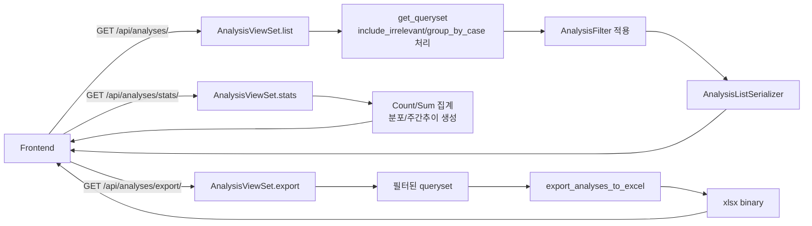
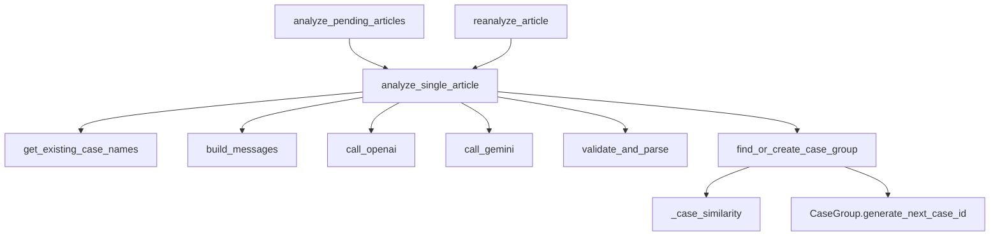
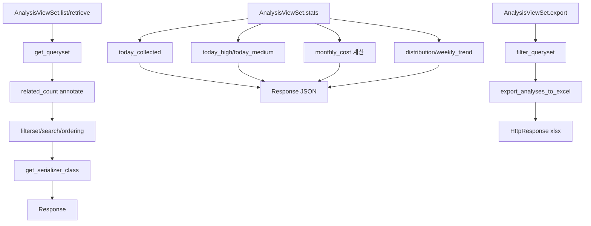

# backend/analyses A-to-Z 가이드

이 문서는 `backend/analyses` 폴더의 워크플로우, 파일 구조, 클래스/함수/필드 역할을 파일 단위로 정리한 문서입니다.

## 1. 폴더 구조

- `backend/analyses/__init__.py`
- `backend/analyses/apps.py`
- `backend/analyses/models.py`
- `backend/analyses/prompts.py`
- `backend/analyses/validators.py`
- `backend/analyses/tasks.py`
- `backend/analyses/serializers.py`
- `backend/analyses/views.py`
- `backend/analyses/urls.py`
- `backend/analyses/export.py`
- `backend/analyses/admin.py`
- `backend/analyses/tests.py`
- `backend/analyses/migrations/__init__.py`
- `backend/analyses/migrations/0001_initial.py`
- `backend/analyses/migrations/0002_analysis_is_relevant.py`

## 2. 전체 워크플로우

1. `articles` 앱에서 기사(`Article`)가 `pending` 상태로 저장됩니다.
2. `analyses.tasks.analyze_pending_articles`가 `pending` 기사들을 순회합니다.
3. 각 기사에 대해 `analyze_single_article`가 실행됩니다.
4. `prompts.build_messages`로 LLM 입력 메시지를 구성합니다.
5. OpenAI 또는 Gemini를 호출해 JSON 응답을 받습니다.
6. `validators.validate_and_parse`로 JSON 파싱/검증/보정을 수행합니다.
7. `find_or_create_case_group`로 사건 그룹을 연결합니다.
8. `Analysis` 레코드를 생성하고 기사 상태를 `analyzed`로 바꿉니다.
9. API(`views.py`)가 목록/상세/통계/엑셀을 제공합니다.

## 3. 파일별 상세

### `__init__.py`

- 비어 있는 파일입니다.
- Python 패키지 인식용입니다.

### `apps.py`

- `AnalysesConfig(AppConfig)` 1개 클래스가 있습니다.
- `default_auto_field = 'django.db.models.BigAutoField'`
- `name = 'analyses'`

### `models.py`

#### `CaseGroup`

- 유사 사건을 묶는 그룹 모델입니다.
- 필드:
  - `case_id`: `CASE-YYYY-NNN` 형식의 고유 ID
  - `name`: 사건명
  - `description`: 사건 설명
  - `created_at`, `updated_at`: 생성/수정 시각
- `Meta`:
  - `db_table = "case_groups"`
  - `ordering = ["-created_at"]`
- 메서드:
  - `__str__`: `[CASE-ID] 사건명` 반환
  - `generate_next_case_id`: 올해 기준 다음 시퀀스 ID 생성

#### `Analysis`

- 기사 1건의 AI 분석 결과를 저장합니다.
- 선택지 상수:
  - `SUITABILITY_CHOICES`: High/Medium/Low
  - `STAGE_CHOICES`: 피해 발생/관련 절차 진행/소송중/판결 선고/종결
- 관계:
  - `article = OneToOneField("articles.Article")`
  - `case_group = ForeignKey(CaseGroup, null=True, blank=True)`
- 주요 필드:
  - `suitability`, `suitability_reason`, `case_category`
  - `defendant`, `damage_amount`, `victim_count`
  - `stage`, `stage_detail`, `summary`
  - `is_relevant`: 법적 분쟁 관련 여부
  - `llm_model`, `prompt_tokens`, `completion_tokens`, `analyzed_at`
- `Meta`:
  - `db_table = "analyses"`
  - `ordering = ["-analyzed_at"]`
  - 인덱스: `-analyzed_at`, `suitability`, `case_category`

### `prompts.py`

- LLM 프롬프트 정책 파일입니다.
- `SYSTEM_PROMPT`:
  - C1~C6 적합 조건, X1 부적합 조건
  - High/Medium/Low 판정 규칙
  - `case_name` 그룹핑 규칙
  - `is_relevant` 판정 기준
  - JSON 출력 스키마 강제
- `FEW_SHOT_EXAMPLES`:
  - user/assistant 예시 대화(High/Medium/Low 케이스)
- 함수 `build_messages(title, content, existing_case_names=None)`:
  - 본문 3000자 절단
  - 기존 사건명 목록을 시스템 프롬프트에 추가
  - system + few-shot + user 메시지 배열 반환

### `validators.py`

- LLM 응답 JSON 검증/보정 담당입니다.
- 상수:
  - `VALID_SUITABILITY`
  - `VALID_STAGES`
- 함수 `validate_and_parse(raw_response)`:
  1. JSON 파싱 실패 시 `None`
  2. 필수 필드 누락 시 `None`
  3. 잘못된 `suitability`는 `Low`로 보정
  4. 잘못된 `stage`는 빈 문자열로 보정
  5. 누락 가능 필드 기본값 채움
  6. `is_relevant`가 bool 아니면 `True`로 보정
  7. `summary` 길이 1000자로 제한
  8. 최종 dict 반환

### `tasks.py`

- 분석 핵심 실행 로직 + Celery 태스크 파일입니다.

#### 상수/전역

- `CASE_SIMILARITY_THRESHOLD = 0.6`
- `_CASE_STOPWORDS`: 사건명 유사도 계산 시 제외 단어 집합

#### 함수

- `call_openai(messages)`
  - OpenAI Chat Completions 호출
  - JSON 응답 강제
  - `(content, prompt_tokens, completion_tokens)` 반환

- `call_gemini(messages)`
  - Gemini 호출
  - messages를 문자열로 변환해 전달
  - `(text, 0, 0)` 반환

- `get_existing_case_names()`
  - `is_relevant=True` 분석이 있는 CaseGroup 이름만 반환

- `_case_similarity(a, b)`
  - `SequenceMatcher` 기반 유사도 + 토큰 보너스 계산

- `find_or_create_case_group(case_name)`
  1. 공백이면 `None`
  2. 완전 일치 그룹 우선
  3. 유사도 최고 그룹이 임계치(0.6) 이상이면 재사용
  4. 아니면 새 `CaseGroup` 생성

- `analyze_single_article(article)`
  1. 기사 상태를 `analyzing`으로 변경
  2. 프롬프트 메시지 생성
  3. OpenAI/Gemini 우선순위 결정
  4. LLM 호출(필요시 fallback)
  5. 응답 검증
  6. CaseGroup 연결
  7. `Analysis` 생성
  8. 기사 상태 `analyzed` 변경

#### Celery 태스크

- `analyze_pending_articles`
  - `pending` 기사 일괄 분석
  - 성공/실패 카운트 반환

- `reanalyze_article(article_id)`
  - 기존 분석 삭제
  - 기사 상태를 `pending`으로 되돌린 뒤 재분석

### `serializers.py`

#### `CaseGroupSerializer`

- 필드:
  - `id`, `case_id`, `name`, `description`, `created_at`
  - `article_count` (`analyses.count` 기반 읽기전용)

#### `AnalysisListSerializer`

- 목록용 직렬화
- 필드 매핑:
  - `article_title <- article.title`
  - `article_url <- article.url`
  - `published_at <- article.published_at`
  - `case_id <- case_group.case_id`
  - `case_name <- case_group.name`
- `source_name` 메서드 필드
- `related_count` 포함

#### `RelatedArticleSerializer`

- 상세 화면의 "유사 기사" 목록용
- 필드: 제목, URL, 발행일, 매체, 요약, 적합도

#### `AnalysisDetailSerializer`

- 상세용 직렬화
- 중첩 필드:
  - `article = ArticleListSerializer`
  - `case_group = CaseGroupSerializer`
- `related_articles` 동적 생성:
  - 같은 그룹 + 관련 기사 + 본인 제외 + 최신순 10건

### `views.py`

#### `AnalysisFilter`

- 필터 파라미터 정의:
  - `suitability` (복수값 가능)
  - `case_category` (icontains)
  - `stage` (Choice)
  - `date_from`, `date_to` (기사 발행일 범위)
  - `case_group`
  - `is_relevant`

#### `AnalysisViewSet`

- `ReadOnlyModelViewSet`
- 기본 queryset은 `article`, `article__source`, `case_group`를 `select_related`
- `get_queryset` 핵심:
  - 기본은 `is_relevant=True`만 노출
  - `include_irrelevant=true`면 전체 포함
  - `group_by_case=true`면 사건별 대표 기사만 노출(목록에서만)
  - `related_count` annotate 추가
- 검색 필드:
  - 기사 제목, 피고, 요약, 사건분야, 케이스ID/이름
- 정렬 필드:
  - 분석일, 기사 발행일, 적합도
- `get_serializer_class`:
  - 상세: `AnalysisDetailSerializer`
  - 목록: `AnalysisListSerializer`

##### 액션: `stats`

- `/api/analyses/stats/`
- 반환:
  - `today_collected`, `today_high`, `today_medium`
  - `total_analyzed`
  - `monthly_cost` (토큰 기반 비용 추정)
  - `suitability_distribution`
  - `category_distribution` (상위 10)
  - `weekly_trend` (최근 7일)

##### 액션: `export`

- `/api/analyses/export/`
- 현재 필터 queryset을 엑셀로 생성
- 첨부파일 응답(`analyses_export.xlsx`)

#### `CaseGroupViewSet`

- `ReadOnlyModelViewSet`
- queryset: `prefetch_related("analyses")`
- 검색: `case_id`, `name`
- 정렬: 최신 생성순

### `urls.py`

- DRF Router 등록:
  - `analyses` -> `AnalysisViewSet`
  - `case-groups` -> `CaseGroupViewSet`
- `path("", include(router.urls))`

### `export.py`

- 함수 `export_analyses_to_excel(queryset)`:
  1. Workbook/Worksheet 생성
  2. 헤더 스타일 적용
  3. 15개 컬럼 헤더 작성
  4. 분석 데이터 행 작성
  5. 적합도 컬러 채움(High/Medium/Low)
  6. 열 너비 조절
  7. 첫 행 고정(`A2`)
  8. `BytesIO` 반환

### `admin.py`

- `CaseGroupAdmin`
  - 목록 컬럼, 검색, `case_id` 읽기전용
  - `article_count` 계산 메서드
- `AnalysisAdmin`
  - 목록 컬럼, 필터, 검색
  - 분석시각/토큰 읽기전용
  - `raw_id_fields = ("article",)`

### `tests.py`

- 현재 템플릿 상태입니다.
- 실제 테스트 케이스는 아직 작성되어 있지 않습니다.

### `migrations/0001_initial.py`

- 초기 생성 마이그레이션
- `CaseGroup`, `Analysis` 테이블 생성
- 분석 관련 인덱스 생성
- 의존성: `articles.0001_initial`

### `migrations/0002_analysis_is_relevant.py`

- `Analysis.is_relevant` 필드 추가 마이그레이션
- `db_index=True`, `default=True`

### `migrations/__init__.py`

- 빈 파일(패키지 인식용)

## 4. 핵심 설계 요약

- `Analysis.article`를 OneToOne로 둬 기사당 분석 1건을 보장합니다.
- LLM 출력의 불안정성을 `validators.py`에서 보정합니다.
- `case_name`을 기반으로 사건 그룹을 자동 연결합니다.
- API 레이어(`views.py`)에서 필터/검색/통계/엑셀을 일관되게 제공합니다.
- `is_relevant`로 무관 기사 노출을 제어합니다.

## 5. 다이어그램

아래 다이어그램은 두 가지 관점으로 나눕니다.

- 파일 간 워크플로우: 어떤 파일이 어떤 파일을 호출/참조하는지
- 코드 실행 워크플로우: 실제 분석이 돌 때 함수 단위로 어떤 순서로 실행되는지

### 5-1. 파일 간 워크플로우



### 5-2. 코드 실행 워크플로우 (기사 일괄 분석)



### 5-3. 코드 실행 워크플로우 (단건 재분석)



### 5-4. API 응답 워크플로우 (목록/통계/엑셀)



### 5-5. `tasks.py` 내부 함수 호출 의존도



### 5-6. `views.py` 내부 요청 처리 흐름



## 6. 읽는 순서 추천

문서를 처음 읽는 경우 아래 순서가 가장 이해가 빠릅니다.

1. `models.py` (데이터 구조)
2. `tasks.py` (분석 실행 핵심)
3. `prompts.py` + `validators.py` (LLM 입력/출력 규칙)
4. `views.py` + `serializers.py` + `urls.py` (외부 API 노출)
5. `export.py` + `admin.py` (운영/보고)
6. `migrations/*.py` (스키마 변경 이력)
```
