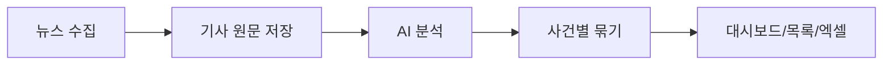
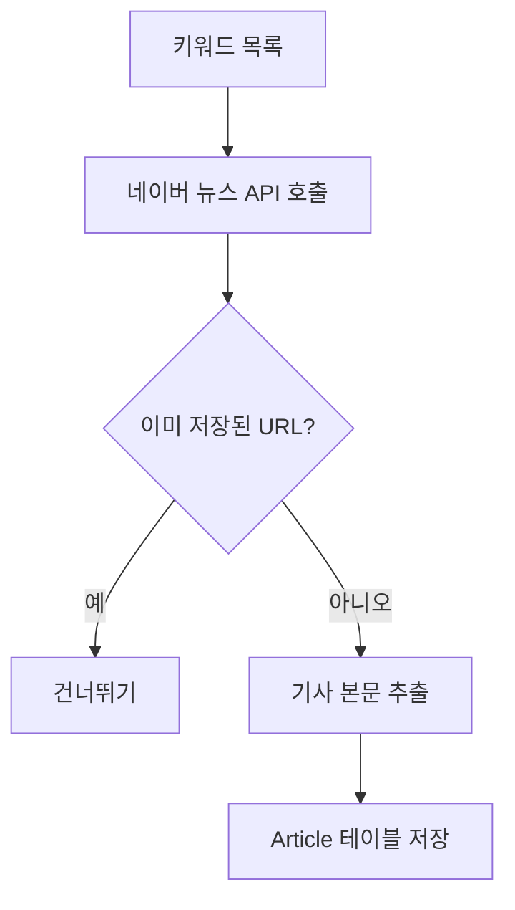
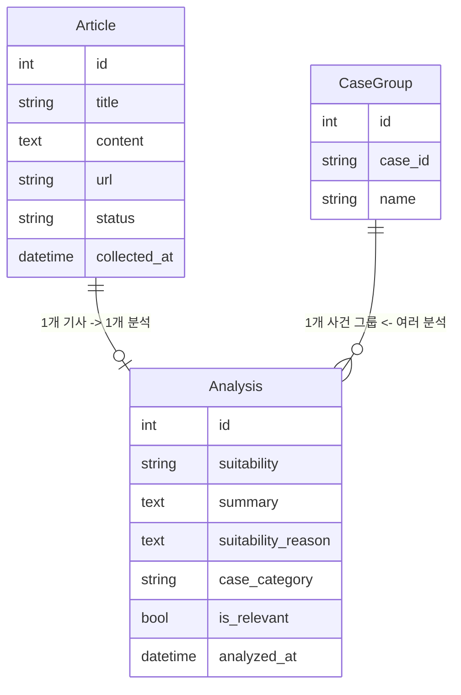
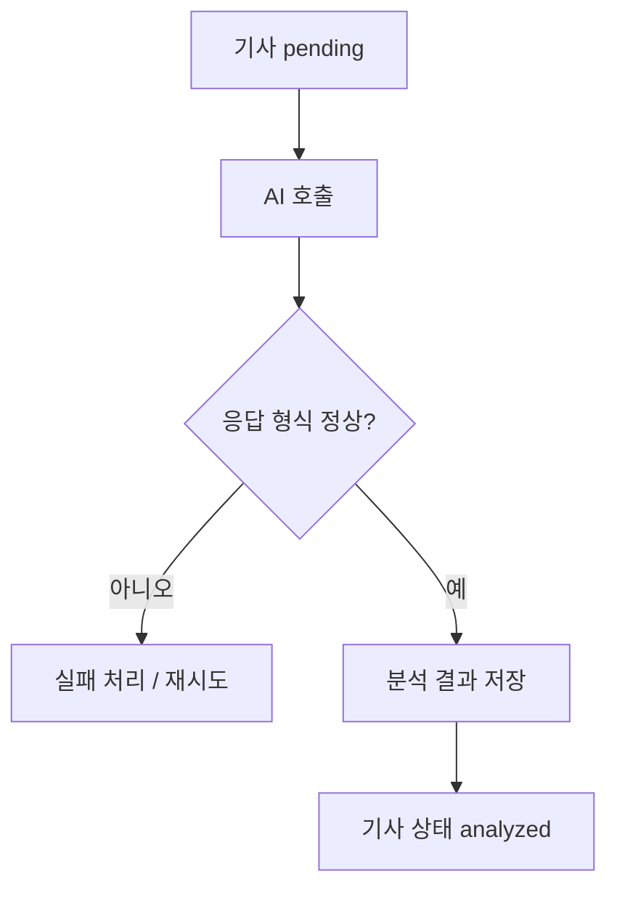
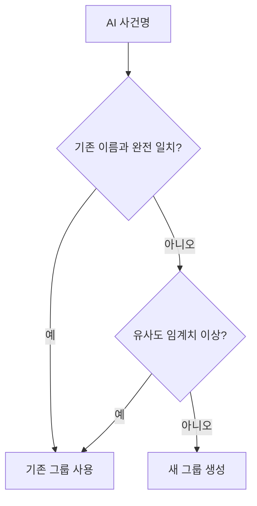
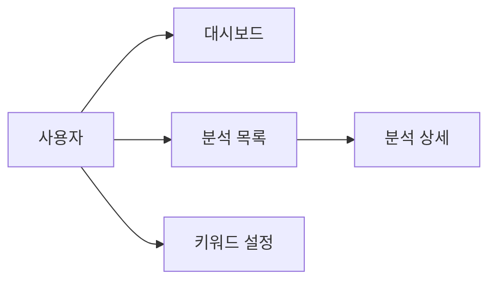
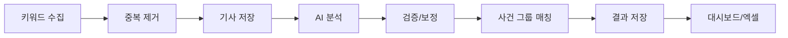

# LawNGood 뉴스 분석 시스템
## 클라이언트 보고서 (비전공자용)

> 이 문서는 기술 구현보다 "무엇을 자동화했고", "어떻게 뉴스가 들어와 분석되어 화면에 보이는지"를 쉽게 설명합니다.

---

## 1. 한눈에 보는 서비스

### 이 시스템이 하는 일

- 법률/분쟁 관련 뉴스를 자동으로 모읍니다.
- AI가 기사 하나씩 읽고 투자 검토 관점에서 점수를 매깁니다.
- 같은 사건의 중복 기사를 한 묶음으로 정리합니다.
- 결과를 대시보드/목록/엑셀로 제공합니다.

### 기존 방식 vs 현재 방식

| 항목 | 기존(수작업) | 현재(자동화) |
|---|---|---|
| 뉴스 수집 | 사람이 검색 | 키워드 기반 자동 수집 |
| 기사 분류 | 사람이 읽고 분류 | AI가 High/Medium/Low 판정 |
| 중복 사건 정리 | 사람이 기억/비교 | 사건 그룹 자동 매칭 |
| 보고 | 수기 엑셀 정리 | 대시보드 + 엑셀 다운로드 |

---

## 2. 전체 흐름 (초간단)

---

## 3. 뉴스는 어떻게 수집되나요?

### 수집 원리

- 미리 정한 키워드(예: 소송, 손해배상, 집단소송)로 뉴스를 찾습니다.
- 네이버 뉴스 API에서 검색 결과를 가져옵니다.
- 이미 저장된 URL은 건너뛰고, 새 기사만 저장합니다.
- 기사 본문(요약이 아닌 실제 텍스트)을 추출해 저장합니다.

### 수집 흐름도

### 중요한 포인트

- 같은 뉴스가 두 번 쌓이지 않도록 URL 중복 체크를 합니다.
- 수집 직후 기사 상태는 `pending`(분석 대기)입니다.

---

## 4. 데이터는 어떻게 저장되나요?

### 저장 구조 (쉽게)

- `Article`:
  - 뉴스 원문 창고
  - 제목, 본문, URL, 수집일, 상태 보관
- `Analysis`:
  - AI 분석 결과 창고
  - 적합도, 요약, 근거, 상대방, 피해규모 등 보관
- `CaseGroup`:
  - 같은 사건을 묶는 폴더
  - 예: CASE-2026-001

### 데이터 관계도

---

## 5. AI는 어떻게 분석하나요?

### 분석 방식

- AI는 기사 제목+본문을 읽습니다.
- 미리 정한 기준으로 적합도를 판정합니다.
- 결과는 JSON 형태로 받아 검증한 뒤 저장합니다.

### 적합도 등급 의미

| 등급 | 의미 |
|---|---|
| High | 투자 검토 우선순위가 높은 사건 |
| Medium | 추가 확인이 필요한 사건 |
| Low | 투자 관점에서 우선순위가 낮은 사건 |

### AI 분석 흐름도

### 안전장치

- 응답 형식이 잘못되면 저장하지 않고 실패 처리합니다.
- 주요 필드가 빠지면 걸러냅니다.
- 필요 시 보정(기본값 설정) 후 저장합니다.

---

## 6. 같은 사건을 어떻게 자동으로 묶나요?

문제:
- 같은 사건인데 언론사마다 제목이 다릅니다.

해결:
- AI가 생성한 사건명과 기존 사건명을 비교합니다.
- 완전 일치/유사도 매칭으로 기존 그룹에 묶습니다.
- 없으면 새 그룹을 만듭니다.

효과:
- 목록이 사건 단위로 정리되어 검토 속도가 올라갑니다.

---

## 7. 사용자는 어디서 무엇을 보나요?

### 화면 구성

- 대시보드
  - 오늘 수집 수, 누적 분석 수, 적합도 분포, 주간 추이
- 분석 목록
  - 검색/필터/사건별 묶기/엑셀 다운로드
- 분석 상세
  - AI 요약, 판단 근거, 유사 기사, 사건 그룹 정보
- 설정
  - 수집 키워드 관리

---

## 8. 운영 관점에서 꼭 알아야 할 점

### 서버 실행 역할 분리

- Django 서버: 화면/API 제공
- 수집 태스크: 뉴스 가져오기
- 분석 태스크: AI 분석 처리

즉, "서버만 켠다"와 "수집/분석이 돈다"는 별개입니다.

### 상태값으로 진행 확인

- `pending`: 분석 대기
- `analyzing`: 분석 중
- `analyzed`: 완료
- `failed`: 실패

운영팀은 이 상태 비율만 봐도 병목을 빠르게 파악할 수 있습니다.

---

## 9. 클라이언트 관점 기대 효과

- 뉴스 모니터링 시간 대폭 절감
- 사건 중복 정리 자동화로 검토 효율 향상
- 동일 기준(일관성)으로 1차 분류 가능
- 대시보드/엑셀로 즉시 보고 가능

---

## 10. 향후 확장 제안 (비기술 관점)

1. 알림 기능
- High 사건 발생 시 즉시 알림(메일/메신저)

2. 우선순위 큐
- 사건 규모/피해자 수 기반 검토 순서 자동 추천

3. 리포트 자동 발행
- 주간/월간 PDF 보고서 자동 생성

4. 심사 히스토리
- 누가 어떤 사건을 최종 검토했는지 기록

---

## 부록. 시각 요약 (원페이지)

> 결론: 이 시스템은 "뉴스 수집 → AI 판정 → 사건 정리 → 보고"를 자동화해, 심사팀의 판단 속도와 일관성을 높이는 데 초점이 맞춰져 있습니다.
