# LawNGood AI 뉴스 분석 시스템 — 기술 문서

> **프로젝트명**: LawNGood News Analyzer
> **목적**: 소송금융 투자 검토를 위한 AI 기반 법률 뉴스 자동 수집·분석 시스템
> **대상 사용자**: 로앤굿(LawNGood) 소송금융 심사팀
>
> 📌 **API·DB·모델 상세**: [FUNCTIONAL_SPEC.md](./FUNCTIONAL_SPEC.md) 참조

---

## 목차

1. [시스템 개요](#1-시스템-개요)
2. [기술 스택](#2-기술-스택)
3. [시스템 아키텍처](#3-시스템-아키텍처)
4. [전체 워크플로우](#4-전체-워크플로우)
5. [데이터베이스 구조](#5-데이터베이스-구조)
6. [뉴스 수집 파이프라인](#6-뉴스-수집-파이프라인)
7. [AI 분석 엔진](#7-ai-분석-엔진)
8. [사건 그룹 자동 매칭 (중복 제거)](#8-사건-그룹-자동-매칭-중복-제거)
9. [유사도 체크 알고리즘](#9-유사도-체크-알고리즘)
10. [AI 프롬프트 설계](#10-ai-프롬프트-설계)
11. [REST API 명세](#11-rest-api-명세)
12. [프론트엔드 화면 구성](#12-프론트엔드-화면-구성)
13. [핵심 코드 로직 상세](#13-핵심-코드-로직-상세)
14. [비용 관리](#14-비용-관리)

---

## 1. 시스템 개요

### 이 시스템이 하는 일

```
한 줄 요약: 법률 뉴스를 자동으로 모아서, AI가 "이 사건에 투자할 만한가?"를 판단해주는 시스템
```

로앤굿은 **소송금융** 회사입니다. 소송금융이란 승소 가능성이 높은 소송에 자금을 투자하고, 승소 시 배상금의 일부를 수익으로 받는 비즈니스 모델입니다.

이 시스템은 다음 과정을 **완전 자동**으로 처리합니다:

1. **뉴스 수집** — 네이버 뉴스 API로 "소송", "손해배상", "집단소송" 등 키워드 관련 기사를 자동 수집
2. **AI 분석** — GPT-4o가 각 기사를 읽고, 소송금융 투자 적합도를 High/Medium/Low로 판단
3. **사건 그룹핑** — 같은 사건에 대한 여러 기사를 하나의 케이스로 자동 묶음
4. **대시보드** — 분석 결과를 웹 화면에서 필터/검색/엑셀 다운로드

### 왜 필요한가?

| 기존 방식 | 이 시스템 |
|-----------|-----------|
| 사람이 매일 수백 건 뉴스를 직접 읽음 | AI가 자동으로 읽고 분류 |
| 같은 사건인지 일일이 비교 | 자동으로 같은 사건 기사를 묶어줌 |
| 엑셀에 수동 정리 | 웹 대시보드 + 엑셀 자동 다운로드 |
| 사람마다 판단 기준이 다름 | 6개 기준(C1~C6)으로 일관된 판단 |

---

## 2. 기술 스택

### 전체 기술 구성도

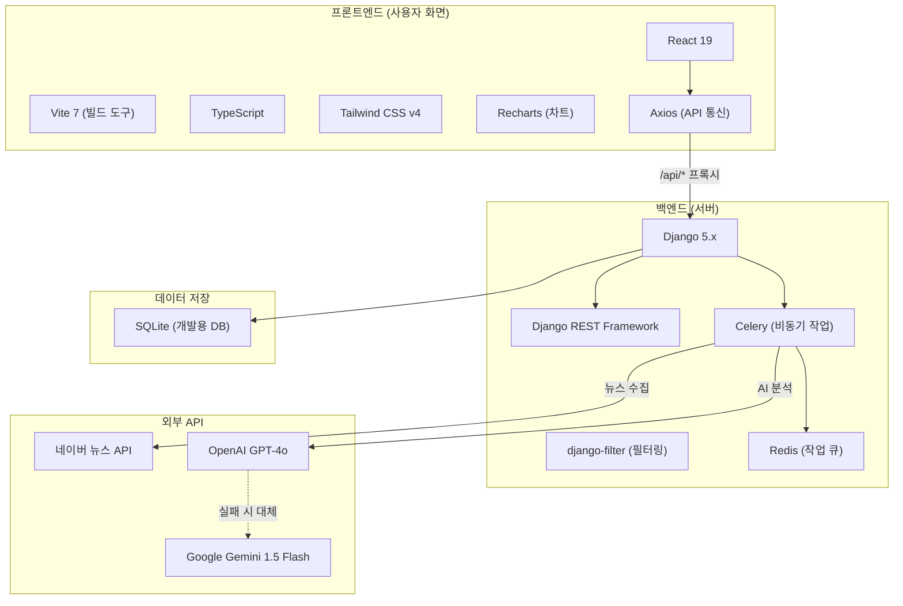

### 기술별 역할

| 기술 | 역할 | 왜 선택했나 |
|------|------|------------|
| **Django 5.x** | 웹 서버, 데이터 관리 | Python 생태계, ORM 강력, 관리자 페이지 기본 제공 |
| **Django REST Framework** | REST API 제공 | 시리얼라이저, 필터, 페이지네이션 자동 처리 |
| **Celery + Redis** | 비동기 작업 처리 | 뉴스 수집/AI 분석이 오래 걸리므로 백그라운드 실행 |
| **React 19 + TypeScript** | 사용자 인터페이스 | 컴포넌트 기반 UI, 타입 안전성 |
| **Vite 7** | 프론트엔드 빌드 | 빠른 개발 서버, HMR(핫 리로드) |
| **Tailwind CSS v4** | 스타일링 | 유틸리티 클래스로 빠른 UI 개발 |
| **GPT-4o** | 기사 분석 AI | 한국어 이해력 최고, JSON 응답 지원 |
| **Gemini 1.5 Flash** | GPT-4o 장애 시 대체 | 저비용 백업 LLM |

---

## 3. 시스템 아키텍처

### 프로젝트 폴더 구조

```
law_news_c_v2/
├── backend/                          # Django 백엔드
│   ├── config/                       # 프로젝트 설정
│   │   ├── settings.py               #   전체 설정 (DB, API키, LLM 등)
│   │   ├── celery.py                 #   Celery 비동기 작업 설정
│   │   └── urls.py                   #   URL 라우팅
│   │
│   ├── articles/                     # 📰 뉴스 수집 앱
│   │   ├── models.py                 #   Article, MediaSource, Keyword 모델
│   │   ├── crawlers.py               #   네이버 API 뉴스 크롤러
│   │   ├── tasks.py                  #   수집 Celery 태스크
│   │   ├── serializers.py            #   API 응답 포맷
│   │   ├── views.py                  #   API 엔드포인트
│   │   └── management/commands/      #   초기 데이터 시딩
│   │       └── seed_initial_data.py  #     키워드 7개 + 언론사 80개 등록
│   │
│   ├── analyses/                     # 🤖 AI 분석 앱
│   │   ├── models.py                 #   Analysis, CaseGroup 모델
│   │   ├── prompts.py                #   AI 프롬프트 (시스템+예시)
│   │   ├── validators.py             #   AI 응답 검증/보정
│   │   ├── tasks.py                  #   분석 Celery 태스크 + 유사도 매칭
│   │   ├── serializers.py            #   API 응답 포맷
│   │   ├── views.py                  #   API 엔드포인트 + 통계 + 엑셀
│   │   └── export.py                 #   엑셀 파일 생성 (openpyxl)
│   │
│   └── db.sqlite3                    # SQLite 데이터베이스 파일
│
├── frontend/                         # React 프론트엔드
│   ├── src/
│   │   ├── App.tsx                   #   라우팅 설정
│   │   ├── main.tsx                  #   진입점
│   │   ├── index.css                 #   디자인 시스템 (색상, 폰트)
│   │   ├── lib/
│   │   │   ├── api.ts                #   API 호출 함수 모음
│   │   │   └── types.ts              #   TypeScript 타입 정의
│   │   ├── pages/
│   │   │   ├── Dashboard.tsx         #   📊 대시보드 (차트, 통계)
│   │   │   ├── AnalysisList.tsx      #   📋 분석 결과 목록
│   │   │   ├── AnalysisDetail.tsx    #   📄 분석 상세 보기
│   │   │   └── Settings.tsx          #   ⚙️ 키워드 관리
│   │   └── components/
│   │       ├── TopNav.tsx            #   상단 네비게이션 바
│   │       ├── SuitabilityBadge.tsx  #   적합도 뱃지 (High/Medium/Low)
│   │       ├── StageBadge.tsx        #   진행 단계 뱃지
│   │       └── StatsCard.tsx         #   통계 카드 컴포넌트
│   └── vite.config.ts               #   Vite 설정 (프록시 포함)
│
├── .env                              # 환경변수 (API 키 등)
└── README.md                         # 프로젝트 개요
```

### 3계층 아키텍처

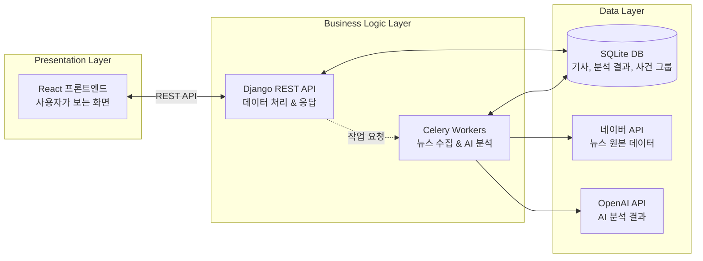

---

## 4. 전체 워크플로우

### 전체 데이터 흐름 (처음부터 끝까지)

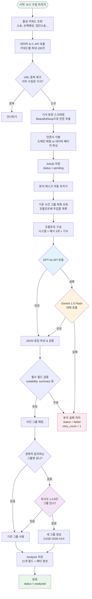

### 워크플로우를 단계별로 쉽게 설명

| 단계 | 무엇을 하나? | 어떤 코드? | 결과 |
|------|-------------|-----------|------|
| **1. 키워드 조회** | DB에서 활성화된 검색 키워드를 가져옴 | `articles/tasks.py` → `Keyword.objects.filter(is_active=True)` | 예: ["소송", "손해배상", "집단소송", ...] |
| **2. 뉴스 검색** | 네이버 뉴스 API로 키워드별 최신 기사 100건 검색 | `articles/crawlers.py` → `search_naver_news()` | 기사 제목, 링크, 날짜 등 |
| **3. 중복 제거** | 이미 수집한 기사(같은 URL)는 건너뜀 | `Article.objects.filter(url=article_url).exists()` | 신규 기사만 통과 |
| **4. 본문 수집** | 기사 링크에 접속해서 전문을 추출 | `crawlers.py` → `fetch_article_content()` | 기사 전체 텍스트 |
| **5. 저장** | Article 테이블에 저장 (status=pending) | `Article.objects.create(...)` | DB에 기사 레코드 생성 |
| **6. AI 분석** | GPT-4o에 기사를 보내서 분석 요청 | `analyses/tasks.py` → `call_openai()` | JSON 응답 (11개 필드) |
| **7. 검증** | AI 응답이 올바른 형식인지 확인 & 보정 | `analyses/validators.py` → `validate_and_parse()` | 깨끗한 데이터 dict |
| **8. 그룹 매칭** | 같은 사건인지 자동 판별 후 그룹에 배정 | `tasks.py` → `find_or_create_case_group()` | CaseGroup 연결 |
| **9. 결과 저장** | Analysis 테이블에 분석 결과 저장 | `Analysis.objects.create(...)` | 분석 완료 |
| **10. 화면 표시** | React 대시보드에서 결과 확인 | 프론트엔드 각 페이지 | 차트, 표, 상세보기 |

---

## 5. 데이터베이스 구조

### ER 다이어그램

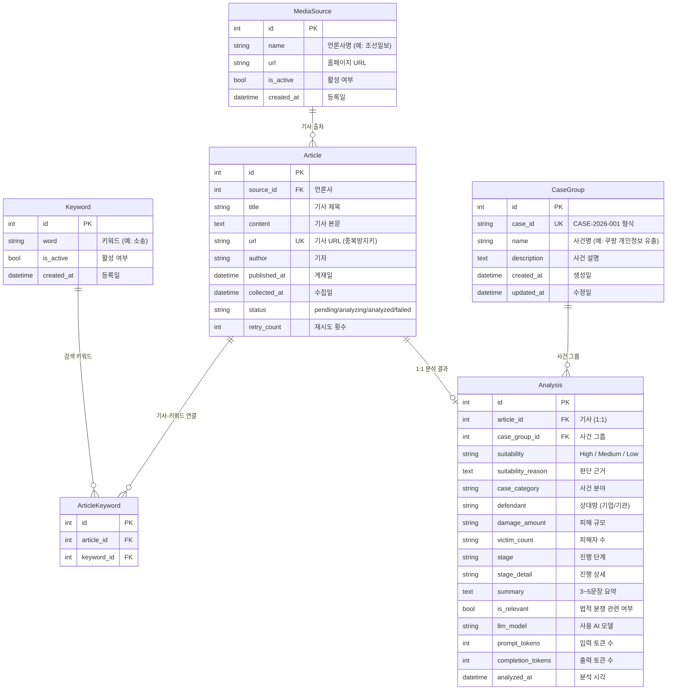

### 각 테이블 설명

#### `articles` — 뉴스 기사

수집된 뉴스 기사 원본 데이터입니다.

| 컬럼 | 타입 | 설명 | 예시 |
|------|------|------|------|
| `id` | INTEGER | 기본키 | 1, 2, 3... |
| `source_id` | FK → MediaSource | 어느 언론사 기사인지 | 조선일보, SBS뉴스 |
| `title` | VARCHAR(500) | 기사 제목 | "쿠팡 개인정보 유출 사태…" |
| `content` | TEXT | 기사 전문 (본문) | (수천 자의 기사 내용) |
| `url` | VARCHAR(500), UNIQUE | 원문 링크 **(중복 방지 키)** | https://n.news.naver.com/... |
| `status` | VARCHAR(20) | 처리 상태 | `pending` → `analyzing` → `analyzed` |
| `retry_count` | INTEGER | 분석 실패 시 재시도 횟수 | 0, 1, 2 |
| `published_at` | DATETIME | 기사 게재일 | 2026-02-15 09:30:00 |
| `collected_at` | DATETIME | 시스템 수집일 (자동) | 2026-02-15 10:00:00 |

**status 상태 흐름:**

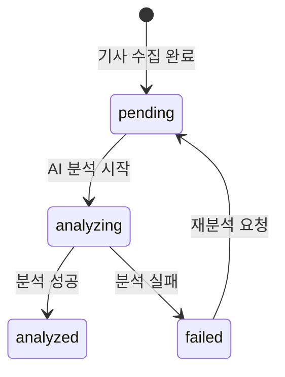

#### `analyses` — AI 분석 결과

AI가 기사를 분석한 결과입니다. 기사 1개당 분석 결과 1개 (1:1 관계).

| 컬럼 | 타입 | 설명 | 예시 |
|------|------|------|------|
| `suitability` | VARCHAR(10) | **소송금융 적합도** | `High`, `Medium`, `Low` |
| `suitability_reason` | TEXT | **판단 근거** (어떤 기준에 해당하는지) | "C1(책임 명확), C2(자력 충분), C3(집단 피해)…" |
| `case_category` | VARCHAR(100) | **사건 분야** | "개인정보", "제조물책임", "노동" |
| `defendant` | VARCHAR(200) | **상대방** (피고가 될 기업/기관) | "쿠팡", "삼성전자" |
| `damage_amount` | VARCHAR(200) | **피해 규모** (금액) | "약 100억 원", "미상" |
| `victim_count` | VARCHAR(200) | **피해자 수** | "약 5만 명", "미상" |
| `stage` | VARCHAR(50) | **진행 단계** | "피해 발생", "소송중", "종결" 등 5단계 |
| `summary` | TEXT | **AI 요약** (3~5문장) | (기사 핵심 내용 요약) |
| `is_relevant` | BOOLEAN | **법적 분쟁 관련 여부** | `True`: 관련, `False`: 무관 |
| `case_group_id` | FK → CaseGroup | **사건 그룹** | CASE-2026-001 |

#### `case_groups` — 사건 그룹

같은 사건에 대한 여러 기사를 하나로 묶는 그룹입니다.

| 컬럼 | 타입 | 설명 | 예시 |
|------|------|------|------|
| `case_id` | VARCHAR(30), UNIQUE | 케이스 ID (자동 생성) | `CASE-2026-001` |
| `name` | VARCHAR(200) | 사건명 | "쿠팡 개인정보 유출" |
| `description` | TEXT | 사건 설명 | (선택 입력) |

**케이스 ID 자동 생성 규칙:**

```
CASE-{연도}-{3자리 일련번호}
예: CASE-2026-001, CASE-2026-002, ...
```

```python
# 코드: analyses/models.py → CaseGroup.generate_next_case_id()
@classmethod
def generate_next_case_id(cls):
    year = datetime.date.today().year        # 2026
    prefix = f"CASE-{year}-"                 # "CASE-2026-"
    last = cls.objects.filter(case_id__startswith=prefix).order_by("-case_id").first()
    if last:
        seq = int(last.case_id.split("-")[-1]) + 1   # 마지막 번호 + 1
    else:
        seq = 1
    return f"{prefix}{seq:03d}"              # "CASE-2026-042"
```

---

## 6. 뉴스 수집 파이프라인

### 수집 흐름 상세

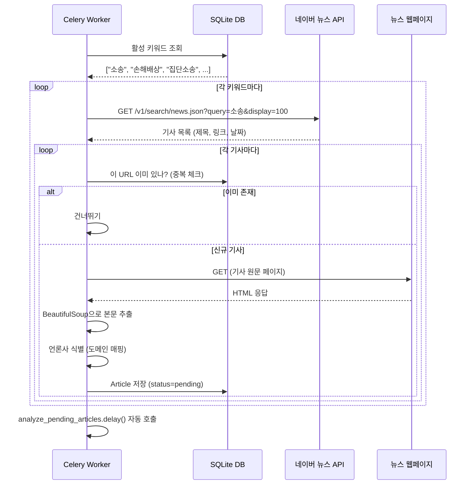

### 핵심: 기사 중복 방지

기사 URL이 데이터베이스에서 `UNIQUE` 제약 조건을 가지고 있어서, 같은 기사가 두 번 저장되는 것을 원천 차단합니다.

```python
# articles/models.py
class Article(models.Model):
    url = models.URLField("URL", max_length=500, unique=True)  # ← UNIQUE 제약
```

```python
# articles/tasks.py → crawl_news()
# 수집 시 URL로 중복 체크
if Article.objects.filter(url=article_url).exists():
    continue  # 이미 수집된 기사 → 건너뛰기
```

### 언론사 식별 방법

뉴스 기사의 출처(언론사)를 자동으로 식별합니다. 2단계로 동작합니다:

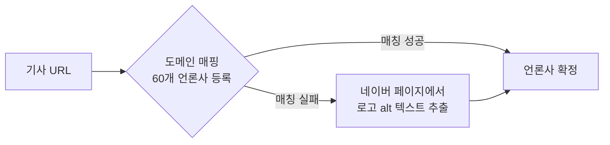

```python
# articles/crawlers.py — 도메인 → 언론사명 매핑 (60개+)
DOMAIN_TO_SOURCE = {
    "www.chosun.com": "조선일보",
    "www.hani.co.kr": "한겨레",
    "www.donga.com": "동아일보",
    "www.mk.co.kr": "매일경제",
    # ... 60개 이상의 언론사 도메인 매핑
}
```

### 기본 검색 키워드 (7개)

| 키워드 | 수집 목적 |
|--------|----------|
| 소송 | 각종 소송 관련 뉴스 |
| 손해배상 | 기업 손해배상 관련 |
| 집단소송 | 집단소송 준비/진행 |
| 공동소송 | 공동소송 관련 |
| 피해자 | 피해자 발생 사건 |
| 피해보상 | 보상 논의 중인 사건 |
| 피해구제 | 구제 절차 진행 중인 사건 |

> 설정 페이지에서 키워드를 추가/삭제할 수 있습니다.

---

## 7. AI 분석 엔진

### AI가 기사를 어떻게 분석하는가?

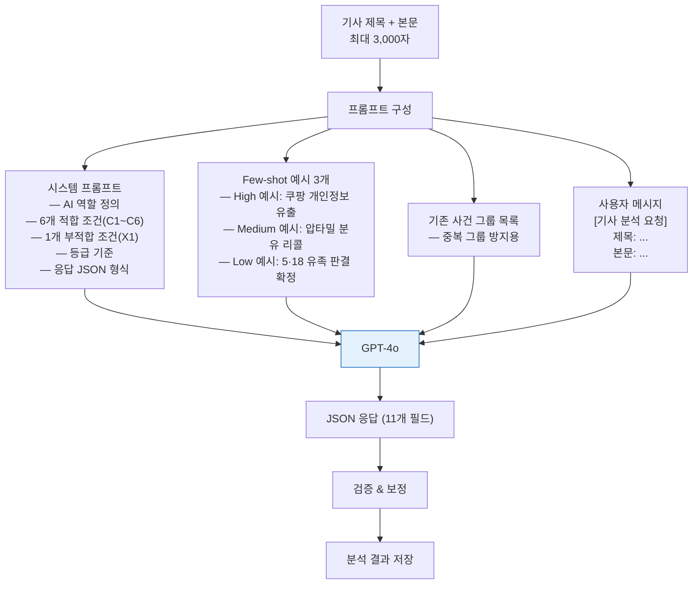

### 적합도 판단 기준 (6+1 조건)

AI는 다음 기준으로 소송금융 투자 적합도를 판단합니다:

#### 적합 조건 (C1~C6)

| 코드 | 조건 | 설명 | 예시 |
|------|------|------|------|
| **C1** | 상대방 책임 명확 | 법적 의무 위반, 과실 등 | 개인정보보호법 위반, 제품 결함 |
| **C2** | 상대방 자력 충분 | 배상능력이 있는 대기업/기관 | 삼성, 쿠팡, 정부기관 |
| **C3** | 집단적 피해 | 피해자가 수십 명 이상 | 집단소송, 대규모 피해 |
| **C4** | 피해 규모 큼 | 수억 원 이상 또는 피해자 수만 명 | 수십억 원 피해, 10만 명 피해 |
| **C5** | 증거 확보 가능 | 증거가 있거나 확보 가능 | 공식 자료, 내부고발 |
| **C6** | 공적 절차 진행 | 수사, 감사, 행정조치 등 | 검찰 수사, 공정위 조사 |

#### 부적합 조건 (X1)

| 코드 | 조건 | 설명 |
|------|------|------|
| **X1** | 이미 종결된 사건 | 판결 확정, 합의 완료 → 투자 불가 |

#### 등급 판정 로직

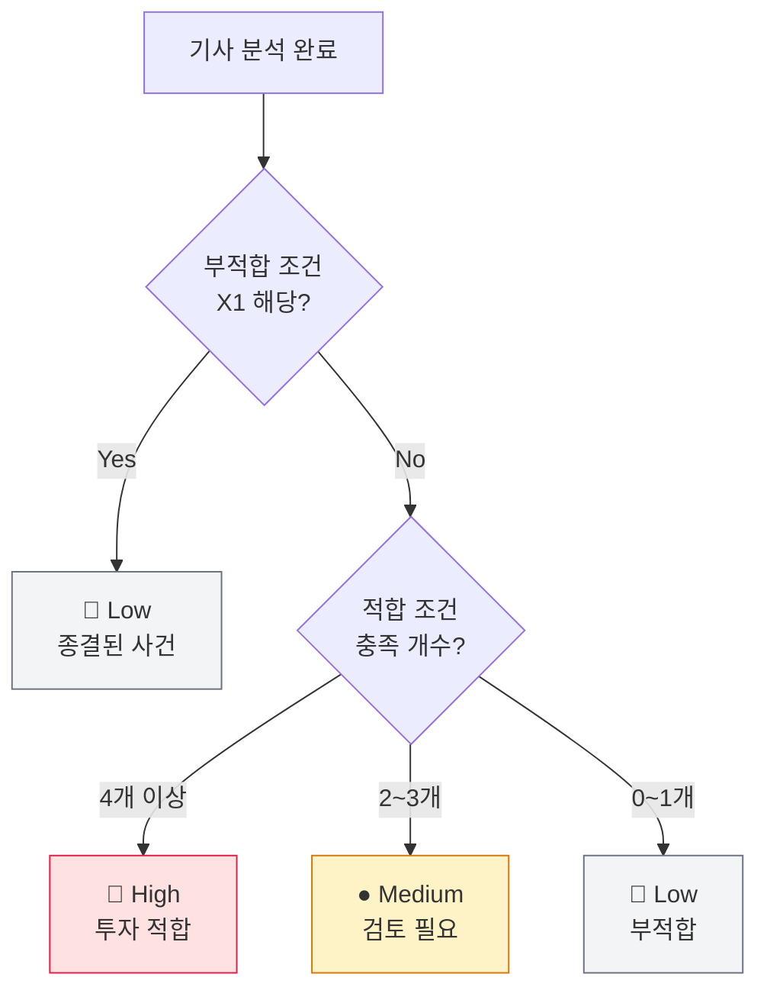

### AI 응답 JSON 구조

AI는 반드시 아래 형식의 JSON으로 응답합니다:

```json
{
  "suitability": "High",
  "suitability_reason": "C1(상대방 책임 명확: 개인정보 유출), C2(자력 충분: 뉴욕증시 상장 대기업), C3(집단적 피해: 다수 소상공인), C6(공적 절차: 집단소송 예고) — 4개 적합 조건 충족",
  "case_category": "개인정보",
  "defendant": "쿠팡",
  "damage_amount": "미상",
  "victim_count": "다수 소상공인",
  "stage": "피해 발생",
  "stage_detail": "집단소송 준비 중",
  "summary": "쿠팡에서 대규모 개인정보 유출이 발생하여 입점 소상공인들이 매출 감소 피해를 입었다. 소공연이 피해 소상공인들을 모아 집단소송을 준비 중이다.",
  "case_name": "쿠팡 개인정보 유출",
  "is_relevant": true
}
```

### AI 응답 검증 & 보정

AI가 잘못된 값을 반환할 수 있으므로, 모든 응답을 자동으로 검증하고 보정합니다:

```python
# analyses/validators.py → validate_and_parse()

# 1. JSON 파싱 실패 → None 반환 (분석 실패 처리)
# 2. 필수 필드 누락 체크: suitability, suitability_reason, case_category, summary
# 3. suitability가 High/Medium/Low가 아니면 → "Low"로 보정
# 4. stage가 5개 선택지에 없으면 → 빈 문자열로 보정
# 5. is_relevant가 boolean이 아니면 → True로 보정
# 6. summary가 1000자 초과 → 잘라내기
# 7. 선택 필드 기본값 설정: defendant="", damage_amount="미상" 등
```

### LLM 장애 대응: 이중 Fallback

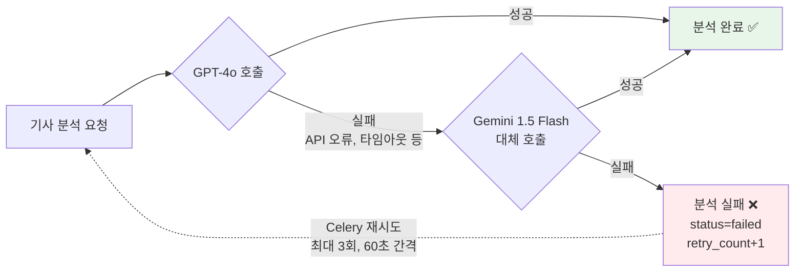

---

## 8. 사건 그룹 자동 매칭 (중복 제거)

### 문제: 같은 사건인데 다른 그룹으로 분류

같은 사건에 대해 여러 언론사가 기사를 쓰면, AI가 미묘하게 다른 사건명을 생성할 수 있습니다:

```
❌ 문제 상황:
├── CASE-2026-310: "게임사 확률형 아이템 허위 표기"   ← 같은 사건인데
├── CASE-2026-312: "확률형 아이템 논란 게임사 신고"   ← 다른 그룹으로
├── CASE-2026-322: "확률형 아이템 논란 5개 게임"     ← 분리됨!
└── CASE-2026-332: "확률형 아이템 공정위 신고"       ←

✅ 해결 후:
└── CASE-2026-203: "확률형 아이템 허위표기 공정위 신고" (10건의 기사가 하나의 그룹)
```

### 해결: 2단계 자동 매칭 시스템

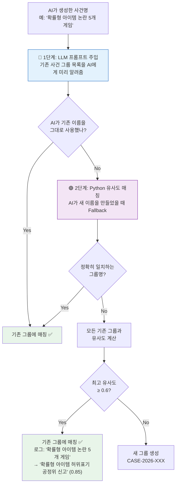

### 1단계: LLM 프롬프트에 기존 목록 주입

AI에게 "이미 있는 사건 그룹 목록"을 알려주고, 같은 사건이면 기존 이름을 그대로 쓰라고 지시합니다:

```python
# analyses/prompts.py → build_messages()

system_content = SYSTEM_PROMPT  # 기본 시스템 프롬프트

# 기존 사건 그룹 목록을 동적으로 추가
if existing_case_names:
    case_list = "\n".join(f"- {name}" for name in existing_case_names)
    system_content += f"\n\n## 기존 사건 그룹 목록\n{case_list}"
```

AI가 받는 프롬프트에는 이런 내용이 추가됩니다:

```
## 기존 사건 그룹 목록
- 쿠팡 개인정보 유출
- 확률형 아이템 허위표기 공정위 신고
- 넥슨 메이플키우기 확률형 아이템
- BTS 부산 공연 숙박요금 인상
- ... (활성 그룹 전체)
```

```
## 시스템 프롬프트 내 지시:
"기존 사건 그룹 목록이 제공될 수 있습니다. 분석 중인 기사가 기존 사건과
동일한 사건이면, 반드시 기존 사건명을 **정확히 그대로** 사용하세요."
```

### 2단계: Python 유사도 매칭 (Fallback)

AI가 그래도 새 이름을 만들면, Python이 기존 그룹과 유사도를 비교합니다:

```python
# analyses/tasks.py → find_or_create_case_group()

def find_or_create_case_group(case_name):
    # Step 1: 정확히 일치하는 그룹 찾기
    existing = CaseGroup.objects.filter(name=case_name).first()
    if existing:
        return existing

    # Step 2: 유사도 매칭 — 모든 기존 그룹과 비교
    best_match = None
    best_ratio = 0.0
    for group in CaseGroup.objects.all():
        ratio = _case_similarity(case_name, group.name)
        if ratio > best_ratio:
            best_ratio = ratio
            best_match = group

    # 유사도 0.6 이상이면 기존 그룹에 매칭
    if best_match and best_ratio >= 0.6:
        return best_match

    # Step 3: 새 그룹 생성
    case_id = CaseGroup.generate_next_case_id()
    return CaseGroup.objects.create(case_id=case_id, name=case_name)
```

---

## 9. 유사도 체크 알고리즘

### 왜 단순 문자열 비교로는 안 되는가?

```
문제 예시:
  A: "두쫀쿠 이물질 소비자 피해"
  B: "해외직구 소비자 피해"
  C: "두쫀쿠 피스타치오 이물질 민원"

단순 SequenceMatcher 결과:
  A ↔ B = 0.56  ← ❌ "소비자 피해"가 겹쳐서 높게 나옴 (다른 사건인데!)
  A ↔ C = 0.50  ← ❌ 같은 사건인데 오히려 낮음

원인: "소비자", "피해", "민원" 같은 일반적인 법률 용어가 유사도를 왜곡
```

### 해결: Stopword 기반 핵심 엔티티 유사도

일반적인 법률 용어(stopword)를 제외하고, **핵심 단어(엔티티)**만으로 유사도를 판단합니다:

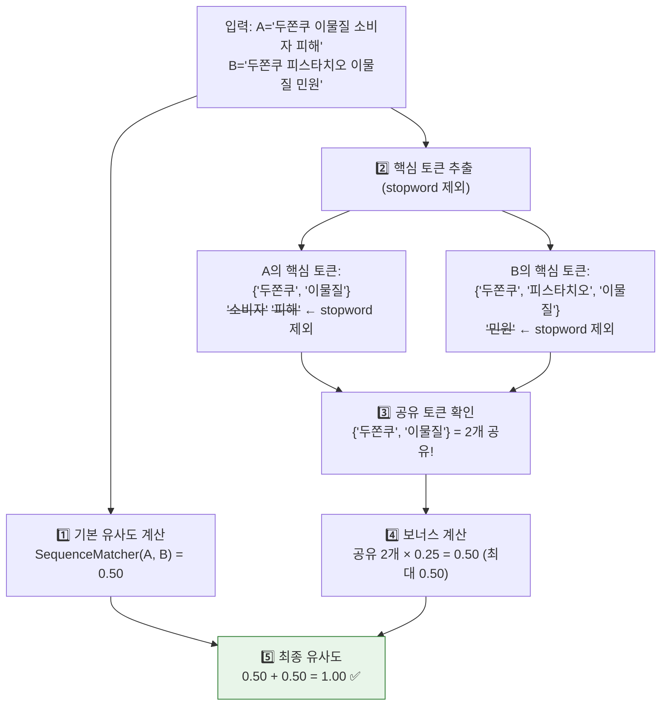

### Stopword 목록 (30개)

사건명에서 자주 등장하지만 **사건의 고유성을 나타내지 않는** 일반 용어들:

```python
_CASE_STOPWORDS = {
    # 법적 절차 관련
    "소송", "분쟁", "사건", "재판", "판결", "기소", "수사",
    "검찰", "경찰", "법원", "소송중", "청구",

    # 피해/사건 일반
    "피해", "소비자", "유출", "논란", "문제", "관련", "사태",
    "조사", "처리", "대응", "보상", "위반", "혐의", "의혹",

    # 행정/기타
    "민원", "접수", "안내", "경고", "주의", "예방",
    "인상", "인하", "확대", "축소", "폭리", "피싱", "스미싱",
}
```

### 유사도 계산 코드 상세

```python
# analyses/tasks.py → _case_similarity()

def _case_similarity(a: str, b: str) -> float:
    """핵심 엔티티 기반 사건명 유사도 (stopword 제외)"""

    # ① 기본 문자열 유사도 (0.0 ~ 1.0)
    seq_ratio = SequenceMatcher(None, a, b).ratio()

    # ② 의미있는 토큰만 추출 (2자 이상, stopword 제외)
    tokens_a = {t for t in a.split() if len(t) >= 2 and t not in _CASE_STOPWORDS}
    tokens_b = {t for t in b.split() if len(t) >= 2 and t not in _CASE_STOPWORDS}

    # ③ 핵심 토큰(엔티티) 공유 여부 → 보너스 부여
    shared = tokens_a & tokens_b
    if shared:
        bonus = min(len(shared) * 0.25, 0.5)  # 공유 토큰당 0.25, 최대 0.50
        return min(seq_ratio + bonus, 1.0)

    # ④ 부분 문자열 매칭: 핵심 엔티티(3자 이상)가 상대방에 포함?
    for t in tokens_a:
        if len(t) >= 3 and t in b:
            return min(seq_ratio + 0.25, 1.0)
    for t in tokens_b:
        if len(t) >= 3 and t in a:
            return min(seq_ratio + 0.25, 1.0)

    # ⑤ 공유 엔티티 없으면 기본 유사도만 반환
    return seq_ratio
```

### 유사도 계산 예시

| 비교 대상 A | 비교 대상 B | 기본 유사도 | 공유 토큰 | 보너스 | **최종** | 판정 |
|------------|------------|-----------|----------|-------|---------|------|
| 두쫀쿠 이물질 소비자 피해 | 두쫀쿠 피스타치오 이물질 민원 | 0.50 | {두쫀쿠, 이물질} | +0.50 | **1.00** | ✅ 매칭 |
| 두쫀쿠 이물질 소비자 피해 | 해외직구 소비자 피해 | 0.56 | {} (소비자,피해=stopword) | +0.00 | **0.56** | ❌ 불일치 |
| ELS 과징금 | ELS 불완전판매 과징금 | 0.67 | {ELS} | +0.25 | **0.92** | ✅ 매칭 |
| 쿠팡 개인정보 유출 | 삼성 개인정보 유출 | 0.65 | {개인정보} | +0.25 | **0.90** | ❌ 다른 사건! |

> **마지막 예시 주의**: "개인정보"가 공유되지만, 실제로는 쿠팡과 삼성은 다른 사건입니다. 하지만 1단계(LLM 프롬프트 주입)에서 이미 목록을 보고 정확한 이름을 사용하므로, 2단계까지 오는 경우는 드뭅니다. 이 경우 수동 확인이 필요할 수 있습니다.

---

## 10. AI 프롬프트 설계

### 프롬프트 구조 (4개 파트)

AI에게 보내는 전체 메시지는 다음 4개 파트로 구성됩니다:

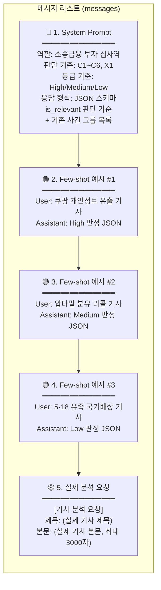

### 시스템 프롬프트 핵심 내용

```
당신은 소송금융 투자를 검토하는 전문 심사역입니다.
두 가지 성격을 가지고 있습니다:
1) 원칙적인 법률 전문가 — 법적 근거와 판례를 중시
2) 공격적인 비즈니스 전략가 — 투자 기회를 적극적으로 탐색
```

### is_relevant (법적 분쟁 관련 여부) 판단

AI는 수집된 기사가 실제 법적 분쟁과 관련이 있는지도 판단합니다:

| `true` (관련 있음) | `false` (관련 없음) |
|-------------------|-------------------|
| 법적 분쟁, 소송, 피해 보상 | 단순 정책 뉴스, 인사이동, 업계 동향 |
| 집단소송, 수사, 법적 책임 | 해외 사건 (한국 무관) |
| 한국 기업·한국인 관련 해외 사건 | 단순 형사 범죄 (개인 간) |
| | 드라마/영화/소설 속 법정 이야기 |
| | 연예/엔터 뉴스, 게임 업데이트 |
| | 칼럼/사설, 예방 캠페인 |

> `is_relevant=false`인 기사는 목록에서 기본적으로 숨겨지며, "무관 기사 포함" 체크박스로 볼 수 있습니다.

### Few-shot 예시가 왜 필요한가?

AI에게 "이렇게 판단하면 된다"는 **구체적인 예시**를 보여줘야 일관된 결과를 얻을 수 있습니다:

| 예시 | 기사 | 판정 | 목적 |
|------|------|------|------|
| 예시 1 | 쿠팡 개인정보 유출, 집단소송 예고 | **High** (C1,C2,C3,C6) | "이렇게 조건이 많으면 High" 학습 |
| 예시 2 | 압타밀 분유 리콜 | **Medium** (C2,C3) | "조건 2~3개면 Medium" 학습 |
| 예시 3 | 5·18 유족 국가배상 확정 | **Low** (X1) | "종결 사건은 Low" 학습 |

---

## 11. REST API 명세

### 전체 API 엔드포인트

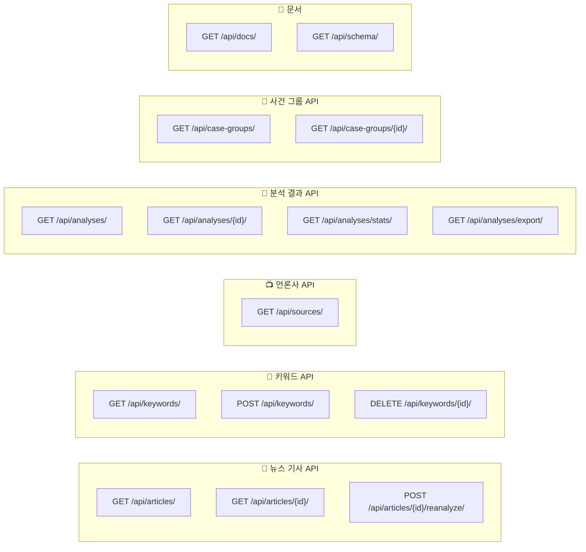

### 주요 API 상세

#### `GET /api/analyses/` — 분석 결과 목록

가장 많이 사용하는 API입니다. 다양한 필터와 검색을 지원합니다.

**쿼리 파라미터:**

| 파라미터 | 설명 | 예시 |
|---------|------|------|
| `search` | 텍스트 검색 (제목, 상대방, 요약, 분야, **케이스ID**, **사건명**) | `?search=쿠팡` `?search=CASE-2026-001` |
| `suitability` | 적합도 필터 (쉼표 구분 가능) | `?suitability=High,Medium` |
| `case_category` | 사건 분야 (부분 일치) | `?case_category=개인정보` |
| `stage` | 진행 단계 | `?stage=소송중` |
| `date_from` / `date_to` | 기사 게재일 범위 | `?date_from=2026-02-01` |
| `group_by_case` | 사건별 묶기 (같은 사건 대표 1건만) | `?group_by_case=true` |
| `include_irrelevant` | 무관 기사 포함 | `?include_irrelevant=true` |
| `ordering` | 정렬 기준 | `?ordering=-article__published_at` |
| `page` | 페이지 번호 | `?page=2` |

**응답 예시:**

```json
{
  "count": 299,
  "next": "http://localhost:8000/api/analyses/?page=2",
  "previous": null,
  "results": [
    {
      "id": 123,
      "article_title": "[단독] '확률형 아이템' 또 논란…게임사 5곳 공정위에 신고",
      "article_url": "https://n.news.naver.com/...",
      "source_name": "한국경제",
      "published_at": "2026-02-14T09:30:00+09:00",
      "suitability": "High",
      "case_category": "확률형 아이템",
      "defendant": "111퍼센트, 그라비티 등 5개사",
      "damage_amount": "미상",
      "victim_count": "미상",
      "stage": "관련 절차 진행",
      "case_id": "CASE-2026-203",
      "case_name": "확률형 아이템 허위표기 공정위 신고",
      "is_relevant": true,
      "analyzed_at": "2026-02-14T10:05:00+09:00",
      "related_count": 10
    }
  ]
}
```

#### `GET /api/analyses/stats/` — 대시보드 통계

```json
{
  "today_collected": 45,
  "today_high": 3,
  "today_medium": 8,
  "total_analyzed": 654,
  "monthly_cost": 12500,
  "suitability_distribution": [
    {"name": "High", "value": 89},
    {"name": "Medium", "value": 134},
    {"name": "Low", "value": 76}
  ],
  "category_distribution": [
    {"name": "개인정보", "value": 45},
    {"name": "제조물책임", "value": 32}
  ],
  "weekly_trend": [
    {"date": "02/10", "total": 15, "high": 2, "medium": 5},
    {"date": "02/11", "total": 22, "high": 4, "medium": 7}
  ]
}
```

#### `GET /api/analyses/export/` — 엑셀 다운로드

현재 적용된 필터와 동일한 조건으로 엑셀 파일을 다운로드합니다.

| 엑셀 컬럼 | 내용 |
|-----------|------|
| No | 일련번호 |
| 케이스 ID | CASE-2026-001 |
| 기사 제목 | 기사 원문 제목 |
| 언론사 | 조선일보, SBS뉴스 등 |
| 게재일 | 2026-02-15 |
| 적합도 | High / Medium / Low (색상 표시) |
| 판단 근거 | C1, C2, C3 충족... |
| 사건 분야 | 개인정보, 제조물책임 등 |
| 상대방 | 기업명/기관명 |
| 피해 규모 | 금액 또는 "미상" |
| 피해자 수 | 인원 수 또는 "미상" |
| 진행 단계 | 피해 발생 ~ 종결 |
| 진행 상세 | 구체적 상황 설명 |
| 요약 | AI 3~5문장 요약 |
| 원문 링크 | 기사 URL |

---

## 12. 프론트엔드 화면 구성

### 페이지 라우팅

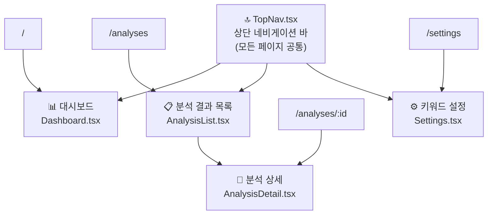

### 각 페이지 설명

#### 1. 대시보드 (`/`)

통계 카드 4개 + 차트 3개 + 최근 분석 5건

| 영역 | 내용 |
|------|------|
| 통계 카드 | 오늘 수집 건수, 전체 분석 완료, 오늘 High 건수, 오늘 Medium 건수 |
| 파이 차트 | 적합도 분포 (High: 빨강, Medium: 주황, Low: 회색) |
| 가로 막대 차트 | 사건 유형 Top 10 분포 |
| 꺾은선 차트 | 최근 7일 추이 (전체, High, Medium) |
| 최근 분석 테이블 | 최신 5건 (적합도 뱃지, 제목, 분야, 날짜) |

#### 2. 분석 결과 목록 (`/analyses`)

필터 + 검색 + 페이지네이션 테이블

| 기능 | 설명 |
|------|------|
| 검색창 | 기사 제목, 상대방, 요약, 분야, **케이스 ID**, **사건명**으로 검색 |
| 적합도 필터 | 전체 / High+Medium / High / Medium / Low |
| 단계 필터 | 전체 / 5개 단계 |
| 사건별 묶기 | 같은 사건 대표 기사 1건만 표시 + **"+N"** 배지로 관련 기사 수 표시 |
| 무관 기사 포함 | `is_relevant=false`인 기사도 표시 (기본 숨김) |
| 엑셀 다운로드 | 현재 필터 조건으로 엑셀 파일 다운로드 |
| 페이지네이션 | 한 페이지 20건, 최대 10페이지 버튼 |

#### 3. 분석 상세 (`/analyses/:id`)

2컬럼 레이아웃

| 왼쪽 (메인) | 오른쪽 (사이드) |
|------------|---------------|
| 기사 헤더 (제목, 적합도 뱃지, 단계 뱃지, 케이스ID) | 상세 정보 카드 (7개 항목) |
| AI 요약 | 사건 그룹 정보 |
| 판단 근거 (배경색으로 등급 표시) | 재분석 요청 버튼 |
| **유사 기사 목록** (같은 사건 그룹의 다른 기사, 최대 10건) | 엑셀 다운로드 버튼 |
| | AI 모델 정보 (GPT-4o, 분석 일시) |

#### 4. 키워드 설정 (`/settings`)

| 기능 | 설명 |
|------|------|
| 키워드 목록 | 현재 등록된 키워드를 pill 태그로 표시 |
| 키워드 추가 | 텍스트 입력 + "추가" 버튼 |
| 키워드 삭제 | 각 태그의 "✕" 버튼 |

### 디자인 시스템

| 요소 | 색상 | 용도 |
|------|------|------|
| Navy `#0F172A` | 어두운 남색 | 네비게이션, 헤더, 엑셀 헤더 |
| Gold `#F59E0B` | 골드 | 브랜드 액센트, 활성 탭 |
| Background `#F1F5F9` | 밝은 슬레이트 | 페이지 배경 |
| High `#E11D48` | 빨강 | 적합도 High |
| Medium `#D97706` | 주황 | 적합도 Medium |
| Low `#6B7280` | 회색 | 적합도 Low |

---

## 13. 핵심 코드 로직 상세

### 뉴스 수집: `articles/tasks.py → crawl_news()`

```python
@shared_task(bind=True, max_retries=3, default_retry_delay=60)
def crawl_news(self):
    keywords = Keyword.objects.filter(is_active=True)
    new_count = 0

    for kw in keywords:
        # 네이버 API로 키워드 검색 (최대 100건)
        items = search_naver_news(kw.word, display=100)

        for item in items:
            article_url = item.get("link")  # 네이버 뉴스 URL 우선 사용

            # 중복 체크: 이미 같은 URL의 기사가 있으면 건너뛰기
            if Article.objects.filter(url=article_url).exists():
                continue

            # 기사 본문 전문 스크래핑
            content = fetch_article_content(article_url)

            # 언론사 식별 (도메인 매핑 → 네이버 페이지 파싱)
            source = _resolve_source(item.get("originallink"), article_url)

            # DB에 저장 (status=pending → AI 분석 대기)
            article = Article.objects.create(
                source=source,
                title=clean_html(item["title"]),
                content=content or "",
                url=article_url,
                published_at=parse_naver_date(item.get("pubDate", "")),
                status="pending",
            )
            new_count += 1

    # 신규 기사가 있으면 자동으로 AI 분석 시작
    if new_count > 0:
        analyze_pending_articles.delay()

    return new_count
```

### AI 분석: `analyses/tasks.py → analyze_single_article()`

```python
def analyze_single_article(article):
    article.status = "analyzing"
    article.save(update_fields=["status"])

    # 1. 기존 사건 그룹 목록 조회 (프롬프트에 주입할 목록)
    existing_case_names = get_existing_case_names()

    # 2. 프롬프트 구성 (시스템 + 예시 3개 + 기사)
    messages = build_messages(article.title, article.content, existing_case_names)

    # 3. GPT-4o 호출 (실패 시 Gemini로 대체)
    try:
        raw_response, prompt_tokens, completion_tokens = call_openai(messages)
    except Exception:
        try:
            raw_response, prompt_tokens, completion_tokens = call_gemini(messages)
        except Exception:
            article.status = "failed"
            article.retry_count += 1
            article.save(update_fields=["status", "retry_count"])
            return False

    # 4. JSON 응답 검증 & 보정
    parsed = validate_and_parse(raw_response)
    if not parsed:
        article.status = "failed"
        return False

    # 5. 사건 그룹 매칭 (정확 매칭 → 유사도 매칭 → 새 그룹)
    case_group = find_or_create_case_group(parsed.get("case_name", ""))

    # 6. Analysis 레코드 저장
    Analysis.objects.create(
        article=article,
        case_group=case_group,
        suitability=parsed["suitability"],
        suitability_reason=parsed["suitability_reason"],
        case_category=parsed["case_category"],
        defendant=parsed.get("defendant", ""),
        damage_amount=parsed.get("damage_amount", "미상"),
        victim_count=parsed.get("victim_count", "미상"),
        stage=parsed.get("stage", ""),
        stage_detail=parsed.get("stage_detail", ""),
        summary=parsed["summary"],
        is_relevant=parsed.get("is_relevant", True),
        llm_model=settings.LLM_MODEL,
        prompt_tokens=prompt_tokens,
        completion_tokens=completion_tokens,
    )

    article.status = "analyzed"
    article.save(update_fields=["status"])
    return True
```

### 사건별 묶기: `analyses/views.py → get_queryset()`

```python
def get_queryset(self):
    qs = super().get_queryset()

    # 기본: 법적 분쟁 관련 기사만 표시
    if self.request.query_params.get("include_irrelevant") == "true":
        pass  # 전체 표시
    elif "is_relevant" not in self.request.query_params:
        qs = qs.filter(is_relevant=True)  # 관련 기사만

    # 사건별 묶기: 같은 사건 그룹 중 가장 최근 기사만 표시
    if self.request.query_params.get("group_by_case") == "true" and self.action == "list":
        # 서브쿼리: 각 사건 그룹에서 가장 최근 기사의 ID
        latest_per_group = (
            Analysis.objects.filter(
                case_group=OuterRef("case_group"),
                is_relevant=True,
            )
            .order_by("-article__published_at")
            .values("id")[:1]
        )
        # 사건 그룹이 없는 기사 전부 + 그룹 있는 기사 중 대표만
        qs = qs.filter(
            Q(case_group__isnull=True)
            | Q(id=Subquery(latest_per_group))
        )

    # related_count: 같은 사건 그룹의 관련 기사 수
    qs = qs.annotate(
        related_count=Count(
            "case_group__analyses",
            filter=Q(case_group__analyses__is_relevant=True),
        )
    )
    return qs
```

### 엑셀 내보내기: `analyses/export.py`

```python
def export_analyses_to_excel(queryset):
    """분석 결과를 엑셀 파일로 변환"""
    wb = Workbook()
    ws = wb.active
    ws.title = "분석 결과"

    # 헤더 행 (진한 남색 배경, 흰색 글자)
    headers = [
        "No", "케이스 ID", "기사 제목", "언론사", "게재일",
        "적합도", "판단 근거", "사건 분야", "상대방",
        "피해 규모", "피해자 수", "진행 단계", "진행 상세",
        "요약", "원문 링크"
    ]

    # 적합도별 배경색
    # High  → 연한 빨강 (#FEE2E2)
    # Medium → 연한 주황 (#FEF3C7)
    # Low   → 연한 회색 (#F3F4F6)

    # 첫 행 고정 (스크롤 시 헤더 항상 보임)
    ws.freeze_panes = "A2"

    # BytesIO 버퍼로 반환 → HTTP 응답으로 전송
    buffer = io.BytesIO()
    wb.save(buffer)
    return buffer
```

---

## 14. 비용 관리

### LLM API 비용 추적

모든 분석에서 사용된 토큰 수를 기록합니다:

```python
# 각 Analysis 레코드에 저장
Analysis.objects.create(
    ...
    prompt_tokens=prompt_tokens,       # 입력 토큰 수
    completion_tokens=completion_tokens, # 출력 토큰 수
)
```

### 월간 비용 계산 (대시보드 stats API)

```python
# analyses/views.py → stats()

# GPT-4o 가격 (2026년 기준)
# 입력: $2.50 / 1M 토큰
# 출력: $10.00 / 1M 토큰

prompt_cost = total_prompt_tokens * 2.5 / 1_000_000    # USD
completion_cost = total_completion_tokens * 10.0 / 1_000_000  # USD
monthly_cost_krw = (prompt_cost + completion_cost) * 1400  # KRW (환율 1400원)
```

### 비용 절약 설계

| 방법 | 설명 |
|------|------|
| 본문 3,000자 제한 | `content[:3000]`으로 잘라서 토큰 절약 |
| Gemini 대체 | GPT-4o 실패 시 저비용 Gemini 사용 |
| temperature 0.1 | 낮은 온도로 일관된 결과 → 재분석 최소화 |
| max_tokens 1000 | 응답 길이 제한 |

---

## 부록: 환경 설정

### `.env` 파일 예시

```env
# Django
SECRET_KEY=your-secret-key
DEBUG=True

# 네이버 뉴스 API
NAVER_CLIENT_ID=your-naver-client-id
NAVER_CLIENT_SECRET=your-naver-client-secret

# OpenAI (GPT-4o)
OPENAI_API_KEY=sk-your-openai-api-key
LLM_MODEL=gpt-4o
LLM_TEMPERATURE=0.1
LLM_MAX_TOKENS=1000

# Google Gemini (백업용)
GEMINI_API_KEY=your-gemini-api-key

# Redis (Celery 작업 큐)
REDIS_URL=redis://localhost:6379/0
```

### 실행 방법

```bash
# 1. 백엔드 서버 시작
cd backend
python manage.py runserver

# 2. 프론트엔드 개발 서버 시작
cd frontend
npm run dev

# 3. Celery 워커 시작 (비동기 작업용)
cd backend
celery -A config worker -l info

# 4. 뉴스 수집 + 분석 실행
python manage.py shell
>>> from articles.tasks import crawl_news
>>> crawl_news()  # 수집 완료 후 자동으로 AI 분석 시작
```

### 접속 주소

| 서비스 | URL |
|--------|-----|
| 프론트엔드 (대시보드) | http://localhost:5173 |
| 백엔드 API | http://localhost:8000/api/ |
| Swagger API 문서 | http://localhost:8000/api/docs/ |
| Django 관리자 | http://localhost:8000/admin/ |
